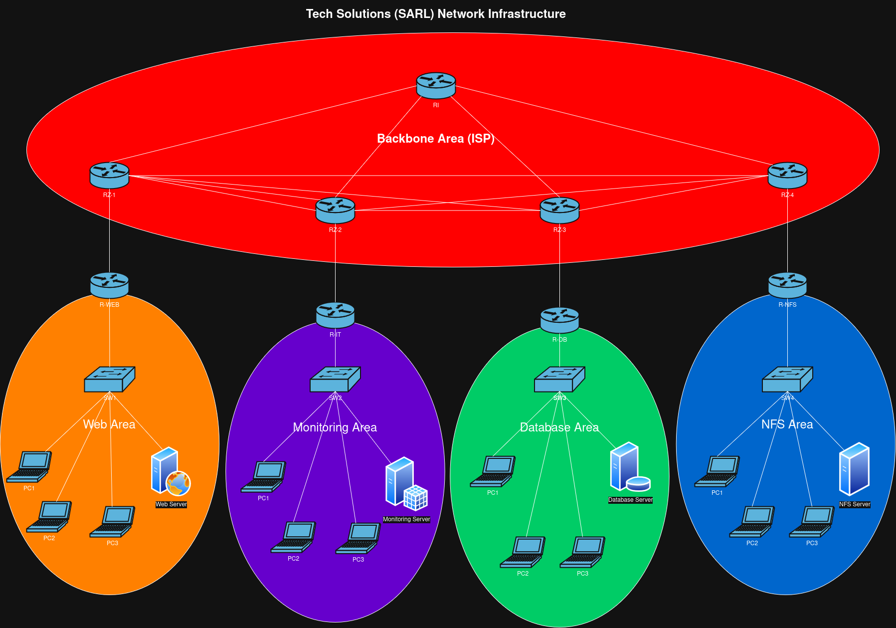

<!-- PROJECT SHIELDS -->

[](https://github.com/ZouariOmar/tech-solutions-sarl-network-infrastructure/graphs/contributors)
[](https://github.com/ZouariOmar/tech-solutions-sarl-network-infrastructure/network/members)
[](https://github.com/ZouariOmar/tech-solutions-sarl-network-infrastructure/stargazers)
[](https://github.com/ZouariOmar/tech-solutions-sarl-network-infrastructure/issues)
[](LICENSE)
[](https://www.linkedin.com/in/zouari-omar-143239283)

<h1 align="center">
  <a href="http://www.amitmerchant.com/electron-markdownify"></a>
  <br>
  Tech Solutions (SARL) Network Infrastructure
</h1>

<h4 align="center">A network infrastructure simulation project built using <a href="https://gns3.com" target="_blank">GNS3</a></h4>


<p align="center">
  <a href="#project-overview">Project Overview</a> •
  <a href="#key-features">Key Features</a> •
  <a href="#installation-%26-setup">Installation & Setup</a> •
  <a href="#download">Download</a> •
  <a href="#emailware">Emailware</a> •
  <a href="#license">License</a> •
  <a href="#contact">Contact</a>
</p>

<p align="center"> </img> </p>

## Project Overview

**Tech Solutions (SARL) Network Infrastructure** is a network infrastructure simulation project built using GNS3.
The project aims to simulate a _complete enterprise network_ with inter-departmental connectivity, routing protocols **(OSPF)**, VLAN configurations, firewall rules, and network security policies.
This project is designed to simulate realistic network environments for education, training, and testing. It demonstrates how to configure network devices such as routers, switches, and firewalls to achieve secure, scalable, and efficient network topologies.

## Key Features

- **Backbone Network Setup**: Core network devices configured to provide inter-department connectivity.
- **Routing Protocols**: Configuration of OSPF and static routing to manage traffic across departments.
- **VLAN & Security**: VLAN configuration, Access Control Lists (ACLs), and firewall rules for secure data flow between departments.
- **Network Design**: A comprehensive network topology for testing various enterprise-level network scenarios.
- **Documentation & Diagrams**: Detailed configuration files, network diagrams, and project structure to help users understand the setup.

## Installation & Setup

### Prerequisites

Before you begin, make sure you have the following software installed:

- GNS3: Download and install GNS3(V3.0.5)
- Cisco Router ([Cisco 3725](https://drive.google.com/file/d/1Q8i5ApabSRYu0QCmtyK2NzcmUWKuiWMD/view?usp=drive_link))
- Cisco Router ([Cisco 3745](https://drive.google.com/file/d/1Aw1Kooz-INVcbFek9yOc4cGsgFE2oO6H/view?usp=drive_link))
- Linux Server ([QEMU-linux-ubuntu-server-20.04](https://cloud-images.ubuntu.com/releases/focal/release))

### Setup the project

- Clone the repo to your local machine

```bash
git clone https://github.com/ZouariOmar/tech-solutions-sarl-network-infrastructure.git
```

- Open GNS3, choose `file/Import project` than select:

```bash
tech-solutions-sarl-network-infrastructure/project/tech-solutions-sarl-network-infrastructure.gns3project
```

## Download

You can [download](https://github.com/ZouariOmar/tech-solutions-sarl-network-infrastructure/releases) the latest installable version of tech-solutions-sarl-network-infrastructure for Windows, macOS and Linux.

## Emailware

tech-solutions-sarl-network-infrastructure is an emailware. Meaning, if you liked using this app or it has helped you in any way, I'd like you send me an email at <zouariomar20@gmail.com> about anything you'd want to say about this software. I'd really appreciate it!

## License

This repository is licensed under the **GPL License**. You are free to use, modify, and distribute the content. See the [LICENSE](LICENSE) file for details.

## Contact

For questions or suggestions, feel free to reach out:

- **GitHub**: [ZouariOmar](https://github.com/ZouariOmar)
- **Email**: [zouariomar20@gmail.com](mailto:zouariomar20@gmail.com)
- **LinkedIn**: [Zouari Omar](https://www.linkedin.com/in/zouari-omar-143239283)

**Happy Coding!**
